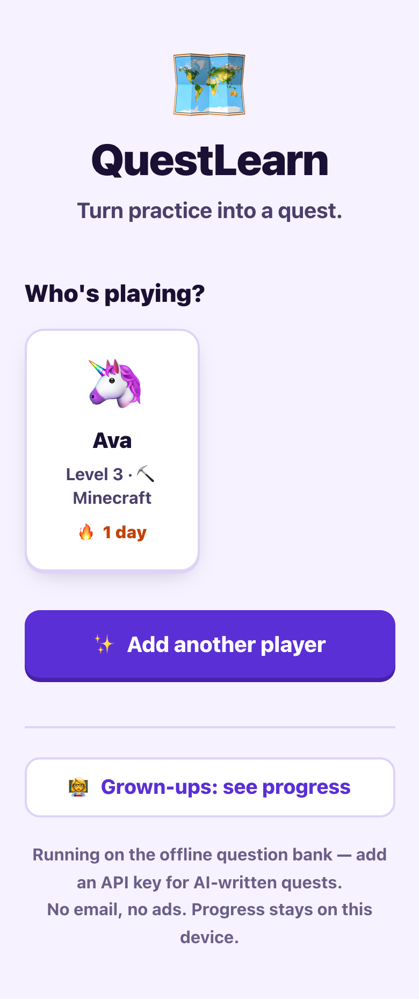
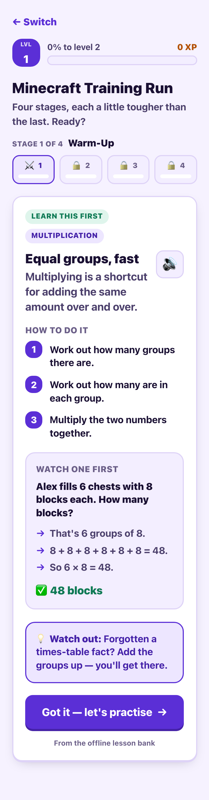
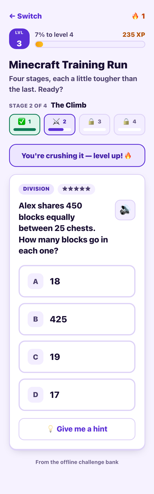
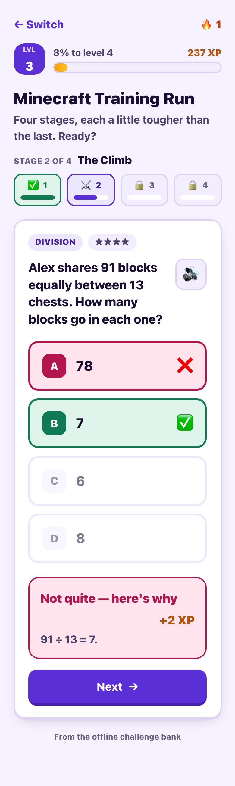
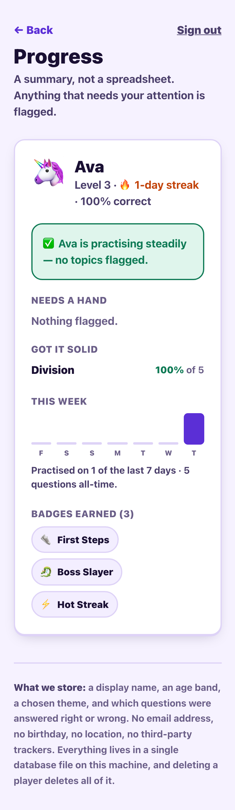

# QuestLearn

Adaptive, gamified learning quests for ages 8–14 — personalised tutoring that
plays like a game, at zero cost per student.

Personal tutoring runs $40–80/hour, so the students who most need it don't get
it. Disengagement compounds the gap: kids fall behind in maths early and rarely
catch back up. Gamification helps, but most ed-tech gamification is badges
stapled to a static worksheet. QuestLearn makes the *content itself* adaptive —
questions are written for one student's level and one student's interests, and
the difficulty moves in real time as they play.

| Pick a player | Learn it first | Then practise | Instant feedback | Grown-up view |
|---|---|---|---|---|
|  |  |  |  |  |

## Quick start

```bash
npm install
cp .env.example .env.local     # add your ANTHROPIC_API_KEY
npm run dev                    # http://localhost:3000
```

**The API key is optional.** Without one, QuestLearn runs the whole flow on a
built-in offline question bank — it is fully playable, just not AI-personalised.
That is the same path the app falls back to when the API is slow or down.

## How it works

```
Pick a profile → Placement quiz → Quest line → Lesson → Practise → Parent dashboard
                  (adaptive         (4 stages,   (teach    (adapts      (summary,
                   staircase)        easy→hard)   first)    per answer)  flagged topics)
```

**Diagnostic.** Seven questions on a staircase — a correct answer steps the
difficulty up, a miss steps it down — so it converges on the student's edge
instead of marching them through a fixed worksheet. Correct answers score at
their full difficulty and misses one step below, so a student who tops out at 4
but misses 5 lands between the two rather than being punished for reaching.
Placement answers are kept out of the practice log so they can't skew the
adaptive engine or the parent summary.

**Teach before you test.** Every stage opens with a short lesson, not a
question: what the skill is, the method in 2–4 steps, one fully worked example,
and the mistake students most often make here. A student who has never been
shown how fractions work can't practise their way into understanding them —
they just fail repeatedly and quit, which is the exact disengagement this is
supposed to fix. Mid-stage, **Show me how again** re-opens the lesson without
costing them their place.

**Quest generation.** Claude writes a themed 4-stage quest line, then each
question inside it, against a fixed topic ladder. The ladder is static and the
content is generated: that keeps sequencing deterministic and the parent
dashboard legible while the questions stay fresh. A Minecraft player gets chests
and stacks of 64; a sports player gets tournament brackets — same underlying
skill either way.

**Adaptive difficulty.** Two misses in a row steps the difficulty down *and*
asks for a scaffolded question — one operation, smaller numbers, a hint that
names the first move. Three quick correct answers in a row steps it up.
Struggle is checked first and can override the stage's nominal difficulty:
getting a student unstuck outranks pushing them.

**Gamification.** XP scales with difficulty, with a speed bonus — and a wrong
answer still earns a little, because a system that only ever rewards already
knowing the answer is the one disengaged students quit first. Levels, daily
streaks, and 12 unlockable badges sit on top, with a celebration overlay that
queues level-ups, badges and stage clears rather than letting them collide.

**Parent/teacher dashboard.** PIN-gated, and a summary by design: a one-line
plain-English headline, topics mastered, topics flagged as hard, a 7-day
activity chart, badges. It never exposes the raw answer log.

## Design decisions worth knowing

**Grading happens on the server.** The question the student is looking at is
held in `current_question`, and the API returns choices without the answer key.
Kids will read the DOM. `POST /api/quest` grades it; a replayed question is
rejected with a 409.

**Two very different access bars.** Students pick an avatar — no password. A
login wall is exactly what stops a kid on a shared phone coming back, and the
profile holds nothing sensitive. The parent dashboard aggregates several
children's progress, so it gets a PIN (scrypt-hashed; sessions stored as a keyed
digest so the database never holds a live credential).

**Minimal data, COPPA-aware.** A display name, an age *band* (not a birthday), an
avatar emoji, a chosen theme, and which questions were right or wrong. No email,
no location, no third-party trackers, no analytics. Everything lives in one
SQLite file; deleting a player deletes all of it.

**The AI is never on the critical path.** Every call is deadlined (9s for a
question, 12s for a quest line). On timeout, error, rate-limit or refusal it
falls through to a per-slot cache of previously generated questions, and then to
the offline generator. A generated question is also rejected before a student
ever sees it if it fails validation — including a cross-check that the model's
stated answer matches the index it gave.

## Testing

```bash
npm test              # bank + lessons + contrast — no server needed
npm run test:bank     # 9,900 generated questions verified
npm run test:lessons  #   330 lessons, every worked example checked
npm run check:contrast

# End-to-end needs a running server and a fresh database
# (it asserts the first-run parent-PIN setup path):
rm -rf data && npm run build && QUESTLEARN_E2E=1 npm start
npm run test:e2e -- http://localhost:3000     # 62 checks through the real HTTP API
```

`test:bank` recomputes the answer to every question the offline generator can
produce — 11 topics × 5 difficulties × 6 themes × scaffolded and not — from its
own prompt text, and asserts the marked choice matches. It also rejects
giveaway distractors (zero, negative, duplicated) and malformed rendering.

`test:lessons` checks every arithmetic claim in every worked example, across
all topics and themes — a lesson with wrong working is worse than no lesson,
because it teaches the mistake. It also asserts every topic in the ladder has a
lesson, so a stage can never open empty.

`test:e2e` drives the real HTTP API: it plays a quest line perfectly and checks
the XP, levels and badges that result, then plays one badly and checks the
engine steps down one rung at a time and scaffolds. It reads the answer key from `/api/dev/peek`,
which returns 404 unless `QUESTLEARN_E2E=1` — and asserts the normal API never
leaks an answer before you commit to one.

## Stack

Next.js 16 (App Router) · TypeScript · Tailwind 4 · SQLite (better-sqlite3) ·
`@anthropic-ai/sdk` with structured outputs via Zod · Claude Opus 5.

One process, one database file, no external services — it runs on a laptop and
deploys as a single app.

```
app/          pages + API routes
components/   QuestionCard, StageTrack, XpBar, Celebration, Speak
lib/
  ai.ts         Claude calls, validation, cache, fallback chain
  adaptive.ts   struggle/mastery detection, diagnostic staircase
  gamify.ts     XP curve, levels, streaks, badge rules
  fallback.ts   offline themed question generator
  lessons.ts    offline lesson bank (verified worked examples)
  play.ts       serve a question, grade it, advance the quest
  progress.ts   parent dashboard summariser
  db.ts         schema + migrations
scripts/      self-tests
```

## Accessibility

All 17 foreground/background pairs meet WCAG AA for normal-size text (verified
by `npm run check:contrast`, not by eye). 18px root font, 56px+ touch targets,
68px answer buttons, visible focus rings, `prefers-reduced-motion` respected,
zoom never blocked, number-key shortcuts, a **Show PIN** toggle so a parent
can't lock themselves out with a mistyped PIN, and a read-aloud button on every
question *and* lesson via the Web Speech API.

## Configuration

| Variable | Default | Purpose |
|---|---|---|
| `ANTHROPIC_API_KEY` | unset | Enables AI generation. Without it, the offline bank is used. |
| `QUESTLEARN_AI_TIMEOUT_MS` | `9000` | Latency budget before falling back. |
| `QUESTLEARN_DATA_DIR` | `./data` | Where the SQLite file lives. |
| `QUESTLEARN_SECRET` | auto | Signs parent sessions. Set explicitly if running more than one instance. |
| `QUESTLEARN_E2E` | unset | `1` enables the test-only answer-key endpoint. Never set in production. |
